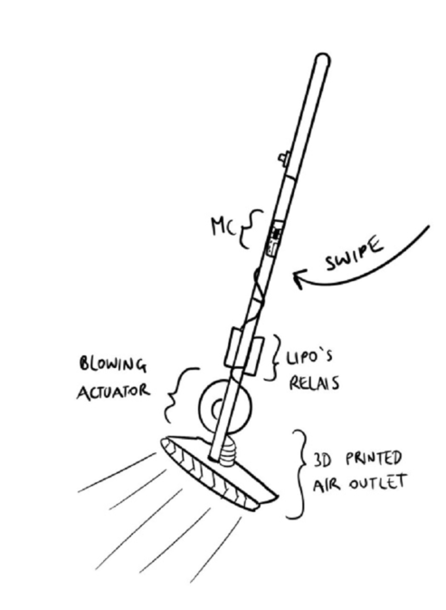

# Project proposal

The initial project concept.

## Idea

-   What action does the device perform? How long does it take?
    -   Instead of swiping with bristles, the broom uses a state-of-the-art guided air stream to not leave any fine particles in their original place.
-   What is a successful result? What is an unsuccessful result?
    -   SUCCESSFUL: The dirt in front of the broom is no longer in front of the broom.
    -   UNSUCCESSFUL: Dirt stays where it was
-   Is the device useful? What does malfunction look like?
    -   USEFUL: It can relocate dirt
    -   MALFUNCTION: Electrocution, Fire, Sucking, No relocation of dirt.
-   What action does the user have to do for the device to work?
    -   Pretend to perform a normal broom-swiping action.
-   What does successful interaction look like? What does unsuccessful interaction look like?
    -   SUCCESSFUL: Broom starts blowing as soon as a defined acceleration is surpassed
    -   UNSUCCESSFUL: Broom does not start blowing; Starts blowing without interaction
-   Where and when would the device be used?
    -   Whenever a normal broom would be used
-   Why / When / For who / How is the device uncomfortable? Is it ever unintentionally comfortable?
    -   Overengineered, does not give you more control than a regular broom
    -   Broom must be recharged regularly OR wired connection always
    -   Vacuum like sounds without any advantages of a vacuum compared to a broom
    -   Never comes into direct contact with dirt, so it does not have to be cleaned

## Implementation

The broom requires a power source, a microcontroller, an acceleration sensor, and a powerful motor.
The user does not have to interact with the broom other than use it like a normal broom.
It will turn on and off by itself when it senses motion.

## Sketch

## Time plan

| Description                                                           | Due date        |
| --------------------------------------------------------------------- | --------------- |
| Acquire some (most) required materials                                | End of November |
| Test motor with chosen power delivers (battery/power line)            | 9.12.           |
| First prototype of broom software                                     | 23.12.          |
| Put hardware and software prototypes together into a single prototype | January 2023    |
