# Final prototype

## Reducing and Components

The first integration test relied on two large LiPo 18.5V batteries and an additional powerbank to power the ESP. One battery was used to power the motor and one for powering the amplifier and speaker. This was convenient for prototyping as the different components were isolated and could be easily disconnected, independent of each other. For our final prototype, we wanted to build _BesAir_ as compact as possible. The LiPo batteries were reduced to one single battery pack and the powerbank was swapped with a Battery to USB charging converter, which is connected to the same battery pack.

## Cosmetics

For the final prototype, a number of parts were modelled in CAD. The base houses the hair dryer fan and channels the air stream out the front. The PVC pipe of the last iteration is reused and attached to the top. For the electronics, two housings were designed. The main housing holds the core electronics. The top housing holds the down firing speaker.

For the design language a slightly retro-esque style was chosen with simple core shapes, lots of chamfers and decorative ridges. Modelling was done in Fusion 360 with 3D printing already in mind. Due to the limited print volume, the parts had to be split into roughly a dozen individual parts. Total printing time was roughly 70 hours.
The electronics casings were printed in transparent PLA to show off the electronics and blinking components inside.

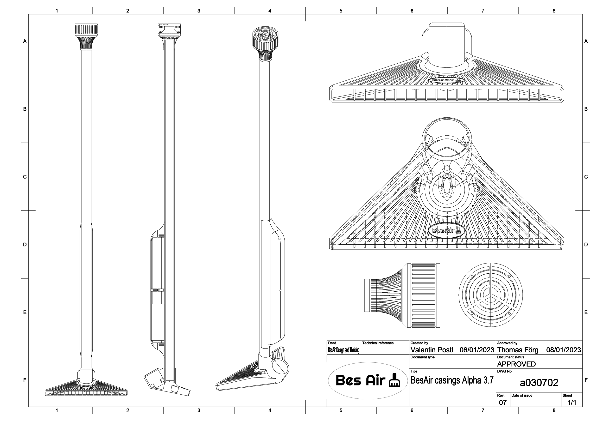{: width="500" }

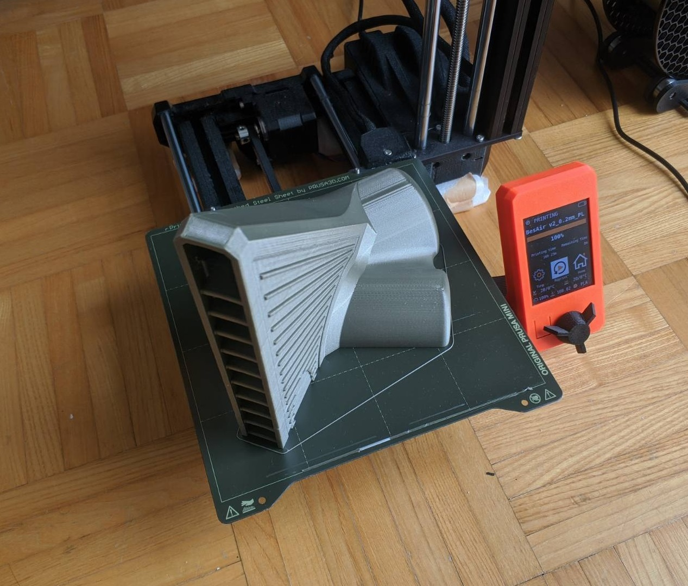{: width="500" }

Significant sanding and gluing work was needed to finalize the 3D Prints, especially for the base part, which warped after printing, but turned out fine after merging the two halfs in iterations with superglue and clamps.

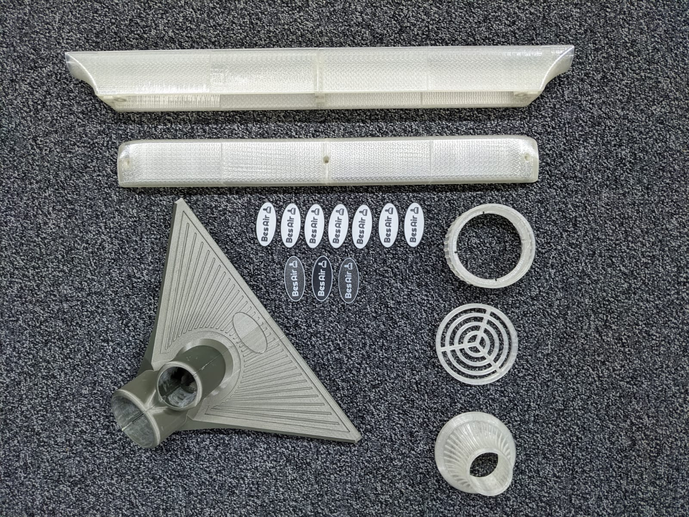{: width="400" }

The main electronics casing was glued to the side of the PVC pipe, with some slots cut out to make room for electronics and routing cables. The motor and pipe mounts simply work by friction to enable easy disassembly during prototyping.

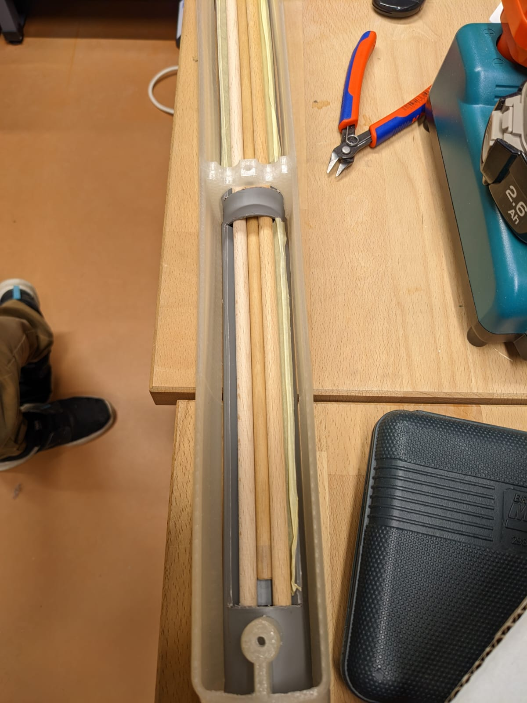{: width="400" }

## Safety

The biggest safety hazard in this project were definitely the LiPo batteries, so the battery packs were always treated with care and preventative measures were taken to prevent overdischarge or other damage to the batteries. For the discharging protection, an off the shelf alarm was used that would sound when the voltage of the battery pack dropped below a certain threshold with a large safety margin. Disconnecting and charging has to be done manually.

For the final prototype, the biggest risk would be short-circuiting the battery pack, while the electronics casing is screwed closed. An external safety switch was added, which completely disconnects the batty from all components.

Officially, _BesAir_ does not have any external buttons, so the safety switch is hidden behind the _BesAir_ logo, that is glued to the front of the PVC pipe.

## Adding LEDs

LEDs were planned early on, but later completely disregarded from the development process. They were only added again once all the components were successfully integrated and mounted within the casing.

One LED strip was added internally along the long side of the main electronics casing, and an LED ring was mounted in the top speaker housing. For the casing, only one side received an LED strip, as using any more LEDs would overshoot the power budget of the USB power delivery. For this reason, the LEDs could also not be turned to their full brightness.

### LED software

A lot of the software used in the previous prototype was reused but had to be extended to accommodate a lot of new features.
Mainly, the code used to detect the current acceleration of the device was changed to detect the total acceleration without the gravity component.
This was done by subtracting the total value from the earth gravity value, which was previously measured and stored as a constant.
To not get a negative value, the absolute value had to be taken:

```cpp
    float total_acc = acc.x * acc.x + acc.y * acc.y + acc.z * acc.z;
    return abs(EARTH_GRAVITY_SQ - total_acc);
```

A lot of code also had to be added to be able to control both the LED strip and the LED ring.
These were both controlled using Adafruit's NeoPixel library.
The LED ring has about 60 LEDs and four different modes:

-   **Off**: Three red LEDs are lit up and moved around the ring
-   **Active**: Three blue LEDs are lit up and moved around the ring
-   **On**: All LEDs light up with random colors that change every update call
-   **Error**: All LEDs light up red

The LED strip always shows the average acceleration value of the device.
The rolling average is calculated using the following code:

```cpp
float average_acc = 0;

void on_update(float acc) {
    average_acc = (average_acc * 0.8) + (acc * 0.2);

    // ...
}
```

The hue of every single LED is calculated by mapping the acceleration value to a value between 0 and 360.
This value is then mapped to a RGB color and sent to the LED strip.

## Audio Signal Interference

After reducing the number of Batteries to one, we encountered a new Problem: Connecting the audio amplifier and ESP to the same ground caused heavy interference in the audio signal. After spending some time on troubleshooting we decided we were unable to fix this problem in time. This left two options: Connecting the ESP to a USB power bank and cutting the LEDs from the prototype (to save on power) or leave the audio as is. Luckily we decided to go with the second option.
A little later on we discovered the LEDs also produce a very audible interference noise when addressed. We chose to use this to our advantage. The spinning LED animation _BesAir_ plays when in standby/of as well as when active also produces an almost mechanical spinning sound through the interference noise.
When the fan is turned on the LEDs are addressed with a random color each tick, which produces a noisy high pitched sound, which nicely pairs with the motor noise.
Whenever audio is played the LEDs are turned off completely to minimize interference.

### Speaker software

It was important that we do not include any screen or external port on BesAir, so we decided to use the speaker to read the current IP address of the device.
There was a lot of different approaches on when to read the IP address, but we decided to read it every time the device is turned off and someone tries to use it.
To be able to read the IP, we created sound files for every number and the dot.
The IP address can be obtained from the ESP Async Webserver library and converted to a string.
The string is then split into single characters and the corresponding sound file is played.

```cpp
void BesAirSound::speak_string(String str)
{
    for (size_t i = 0; i < str.length(); i++)
    {
        char buf[30];
        if (str[i] == '.')
        {
            sprintf(buf, "%s.mp3", "dot");
        }
        else
        {
            sprintf(buf, "%c.mp3", str[i]);
        }

        BesAirSound::play_sound(buf);
    }
}
```

In this case, we used the blocking call to `play_sound` because each file should be played in order and not at the same time.
This also has the consequence that if the IP is being read and an async web request turns the device on, it will say "Activated" and then continue reading the IP before being able to turn on the motors.

## Final Assembly

During the final assembly phase a lot of small problems turned up which made this phase take longer than anticipated.
We decided to solder the ESP and all of the different sensor and actor connections to avoid them falling apart when the device is all closed up and in use. Additionally we decided to glue the accerlerometer to the base part to ensure the motion-detection of the broom is not influeced by the sensor moving slightliy within the casing.
Some of the connections went apart quite often in the first prototype due to the high forces acting on the broom while moving it back and forth quickly.

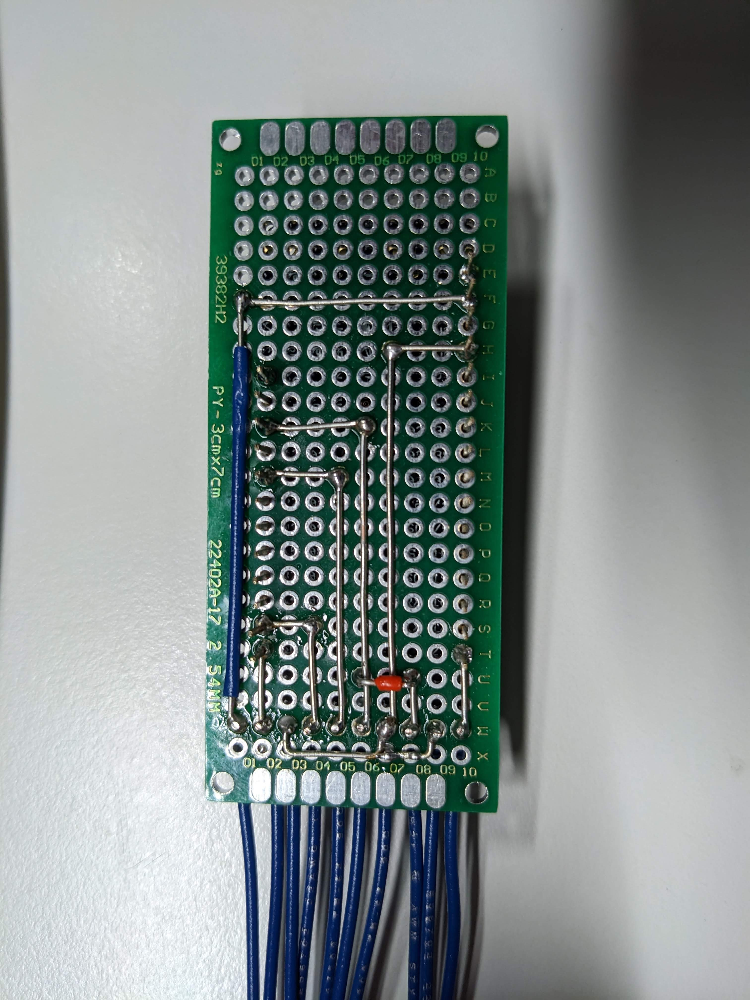{: width="200" }
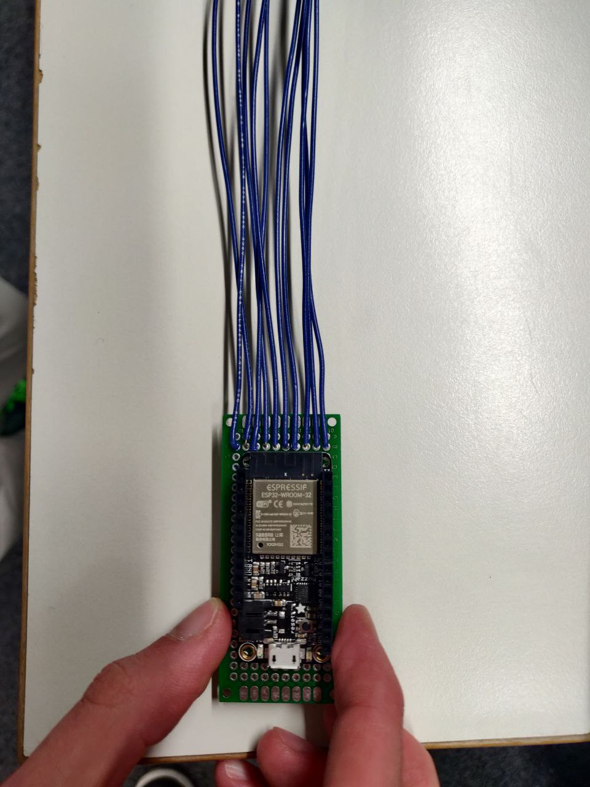{: width="200" }

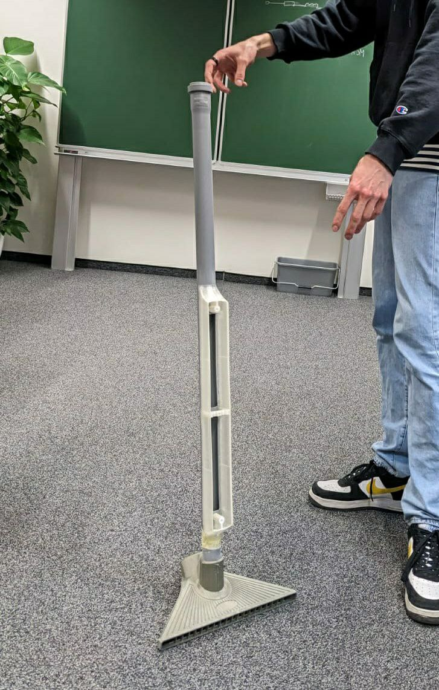{: width="300" }

In order to ensure a smooth and precise fit, we sanded the various components. We used a Dremel to widen and smooth out the gap for the fan. We also used a disk sander on the PVC pipe to press-fit with the 3D printed base part, as it was a heavy part and needed to withstand some force while using the BesAir. The speaker and LED ring setup also press-fit perfectly at the end of the PVC pipe.

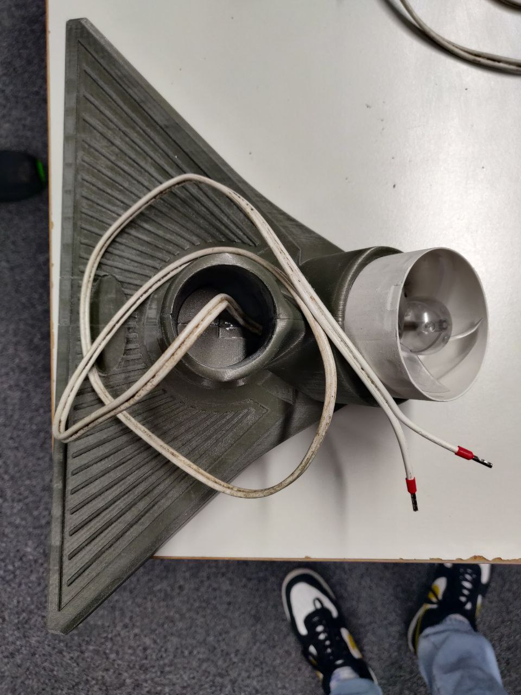{: width="300" }

After all the casing parts were fitted nicely, we lengthened the cables for the fan and crimped them for better modularity.

Before closing everything up we decided to also add connectors to almost every other cable in order be able to easily reopen and work on the device. This way we can dismantle everything and work on each component on its own before putting everything together again. As we decided to extend the broomstick length slightly by adding an 30cm long extension-pipe, this proved to be very useful. The modification could be easily made by simply disconnecting the speaker unit, eliminating the need for soldering.

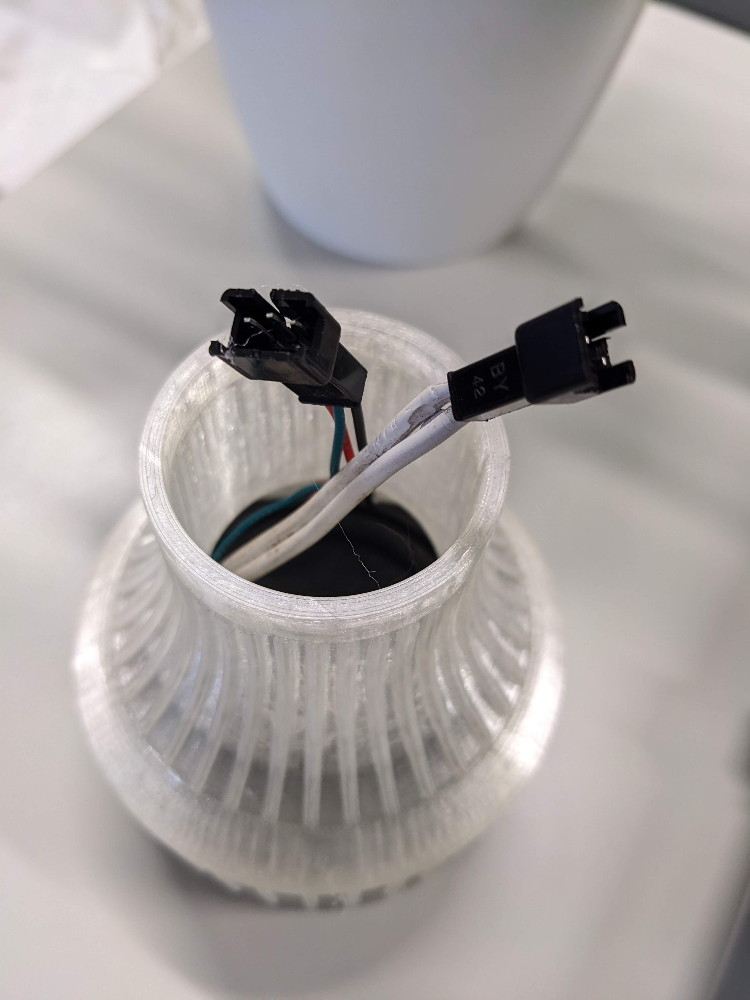{: width="250" }

Finally with all components soldered and connected we could test if everything would fit into the enclosure as planned and if the device would work as expected.

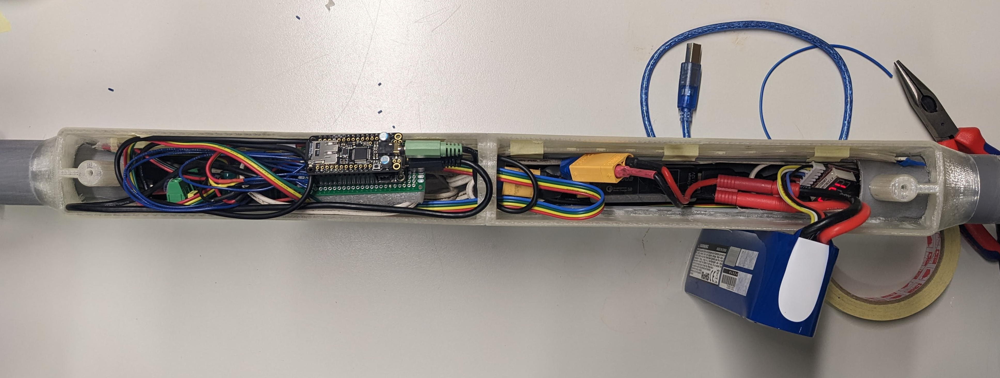

The final product was uncomfortable for testers in different ways. Also, the magnitude of discomfort lies on different features for different people.

Frequent opinions of discomfort in BesAir:

1. Keeping constant and alternating motion for constant blowing
2. Lack of precision when actually "cleaning"
3. Turning it on requires smartphone connection, (manual IP input by listening to stated IP takes time)
4. Permanent idle-sound / sound next to ear
5. Angle of the broomstick makes it more difficult to operate
6. Always holding BesAir above the ground
7. Pointy blades of fan are unprotected (also pulls and tear things close to it within)
8. Language setting does not change language
9. Unexpected random audio statements

After closing everything up, the insides view through the half-transparent 3D printed enclosure looked like this:

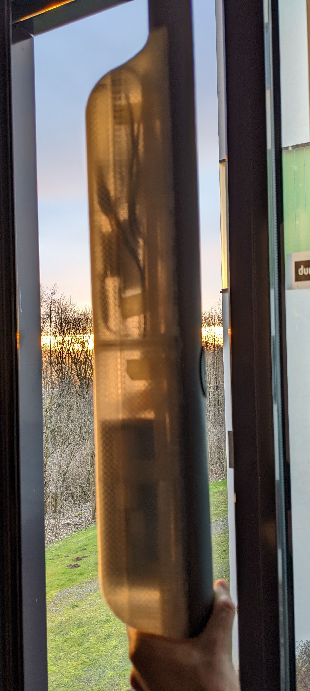{: width="300" }
