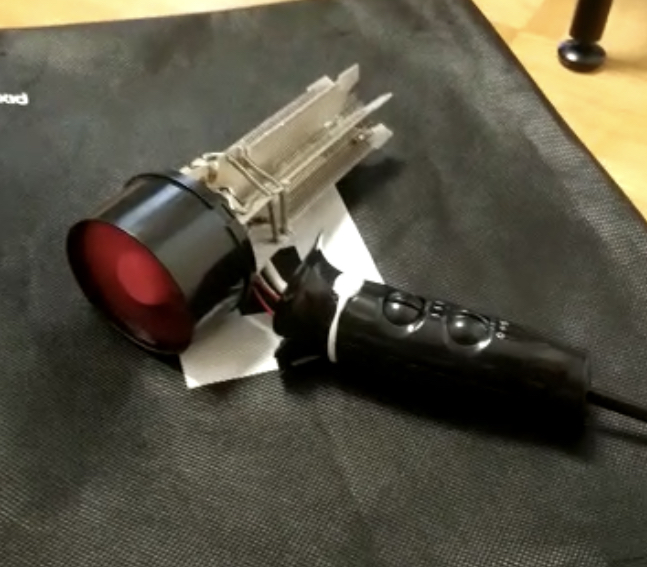
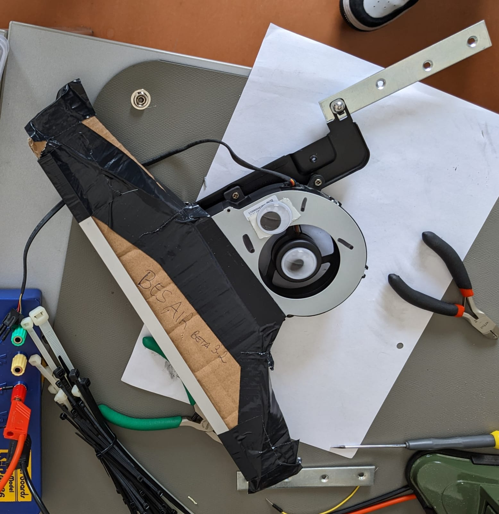

# Component testing

## Motor

The very first motor we aquired was from an old, broken hair dryer.

{: width="300" }
{: width="500" }
{: width="400" }

We had to 3D-print a new fan for the motor because the installed one was already broken from being thrown away.
After extracting the motor and adding the new fan, we tested the motor with different power sources.

{: height="400" }

While testing the motor with a 18V LiPo battery we sadly overwhelmed and broke the motor.
We found however that one or maybe even two of these motors should be able to power the _BesAir 200_.

We later luckily found a new motor in the form of an old server fan.
It was not as strong as the hair dryer motor, but it was sufficient as a starting point for a first prototype.
We however still ordered a few old hair dryers from Willhaben to eventually get a stronger motor for a later prototype.

{: height="400" }

The depicted prototype above using the server fan also had a nozzle attached to it.
It was made out of carton and tape and we hypothesized that it would be able direct the airflow in a more precise way.
It turned out that most of the air still got out in the middle of the nozzle and the sides almost got no airflow at all.
In contrast to the hair dryer motor, the server fan also required a pwm signal to control its speed instead of a simple on/off signal via a relay.
It also was not able to spin down to a complete stop if no signal was provided but rather stayed at a very low speed.

## Sensors and Software

{: height="500" }

After aquiring an accelerometer, we started implementing the software for the _BesAir 200_.
The first step was to get the current acceleration and check if it is above a certain threshold.
This however turned out to be slightly more challenging than expected.
The accelerometer constantly measured a value of 9.8 m/s², which is the acceleration due to gravity.
When moving the device it could then lead to inconsistent measurements because in some cases gravity was working against the movement and in others it was working with it.
To counteract this we decided to calculate the total acceleration of the device by using the following formula:

$$a = \sqrt{a_x^2 + a_y^2 + a_z^2}$$

Basically, this formula gives us the length of the total acceleration vector instad of measuring the acceleration in each direction separately.
Because this calculation is happening very often we simplified the calculation to the following:

```c
float total_acc = acc_x * acc_x + acc_y * acc_y + acc_z * acc_z;
```

The resulting value was then compared to a threshold value and if it was above the threshold the motor was turned on.
There were two seperate ways to conrol the motor.
One using pwm to control the speed for the server fan and one using a binary on/off signal for the hair dryer motor.
To not turn off the motors too early, we also added a timer that would turn off the motor only after a certain amount of time.
The following code shows a simplified version of the software that was used for the first prototype.

The code basically went through the following steps:

1. Read the acceleration from the accelerometer
2. Calculate the total acceleration
3. Check if the total acceleration is above the threshold
    1. If it is, turn on the motor and reset the timer
4. If it is not, check if a specified time has passed since the last reset
    1. If it has, turn off the motor

## Integrating the prototypes

{: height="500" }

{: height="500" }

{: height="500" }
