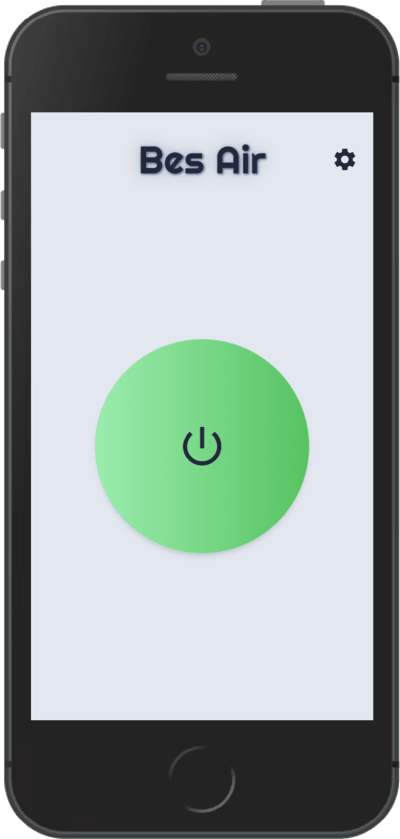
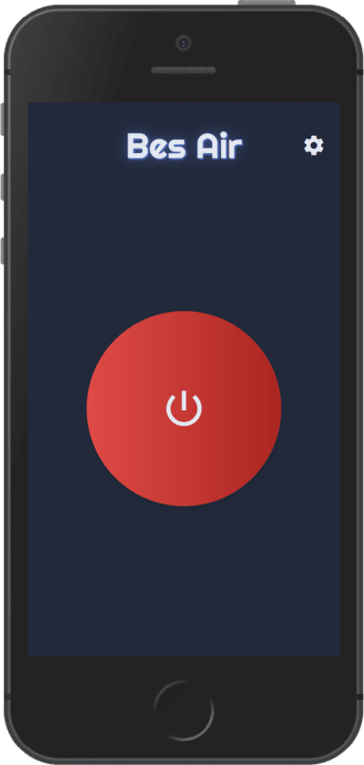
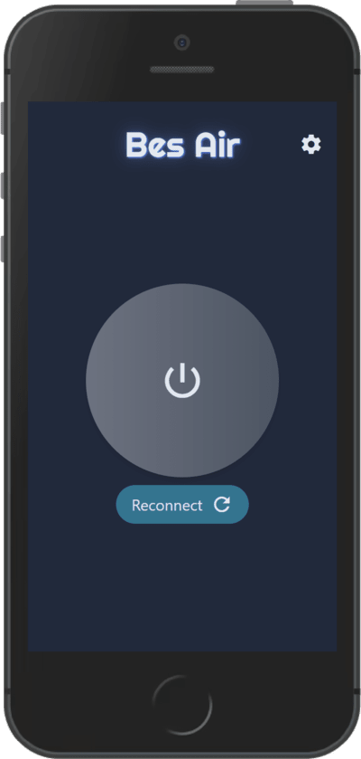

# App development

## Introduction
The idea is to extend the **BesAir 200 Esp Wroom 68** experience by developing an app which remotely controlls the **Bes Air** device. Features like turning the device on and off are a must. Other interactions like changing the LED lighting or playing a sound are planned. Only the future will tell how far we will reach into the bag of absurdity.

## Development documentation

The web app is optimized for mobile but works on all devices.

### Big Fat Button

This clearly important button turns the device on or off. It also communicates to the user when the **Bes Air** lost connection.

Light Mode Turn On  |  Light Mode Turn Off
:------------------:|:-------------------------:
  |  

Dark Mode Turn Off  |  Dark Mode Reconnect
:------------------:|:-------------------------:
  |  
