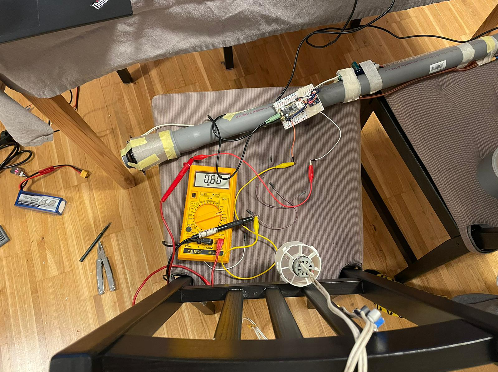
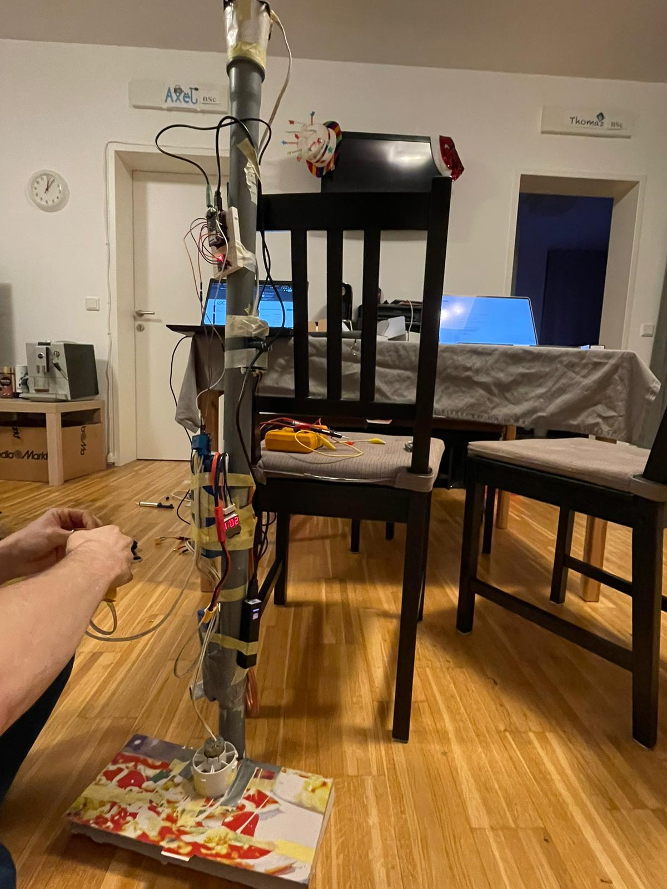

# Integrating the different parts

After testing all components on their own and integrating them in some initial tests we decided to make a very rough prototype containing all aspects of the final product in one package.

## ESP32 code

The different parts of the software running on the ESP have been coded by different people, each using their own chip.
This resulted in a lot of blocking code in the differnt parts of the application for timing and communication.
The code was split up into the webserver, the sound controller and the last part controlling the motor and reading from the sensors.
To integrate all the different parts a lot of the code had to be refactored to not block the execution of the other parts, which meant getting rid of all `delay()` and similar calls.
Timing things had to be converted to store timestamps for different events and cecking them every loop iteration.
A workaround also had to be found for the sound-driver, which only supported blocking code on the version of the chip we were using.
This was because the specific chip we were using did not support the required interrupts for the sound library.
The workaround was to check the sound buffer every loop interation and add new samples if the buffer was running low.

## Hardware

We decided to make the prototype portable and to power everything from batteries for the first version.
This was archieved by using two 18.5V batteries for the motor and the speaker and a USB powerbank for the ESP.
Because we used a hairdryer motor we had to use a step-down converter to avoid the motor burning out when turning on.
The motor was controlled by a relay, which was connected to one of the ESP's GPIO pins.

{: width="500" }

The speaker was connected to an amplifier which was also powered by a 18.5V battery.
All the components were sticked onto a plastic pipe and a cardboard box was used to direct the air flow.

{: width="300" }

In this version the accelerometer was also already working as intended and the motor could be controlled by moving the device faster than a certain threshold.

    <video width=100% preload="auto" controls>
        <source src="assets/prototype-1/ba_activasion.mp4" type="video/mp4">
        Your browser does not support the video tag.
    </video>

## App

Activating or deactivating the device using the app was also already possible:

    <video width=100% preload="auto" controls>
        <source src="assets/prototype-1/ba_app-child-voice.mp4" type="video/mp4">
        Your browser does not support the video tag.
    </video>

