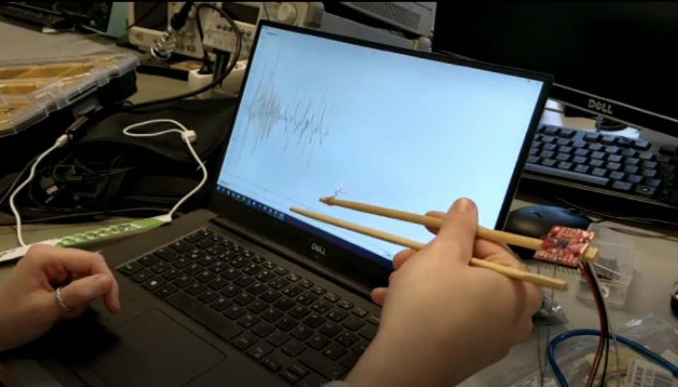
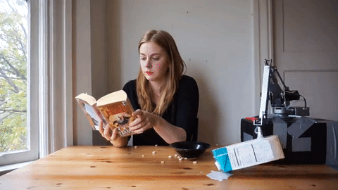

# BesAir 200 Esp Wroom 68

Project documentation for the **Design for Physical Prototyping** course 2022/23 focusing on the topic of **Uncomfortable Devices**.

## Abstract

Shortly summarize the intentions and ideas behind your project. 
Lorem ipsum dolor sit amet. This project builds upon the idea of [Chindōgu](https://en.wikipedia.org/wiki/Chind%C5%8Dgu), the practice of inventing ingenious everyday gadgets that seem to be ideal solutions to particular problems, but which may cause more problems than they solve. Lorem ipsum dolor sit amet.

## Concept

Here you could summarize your project proposal. How did you plan to build your prototype? Did you arrive at your idea immediately or did you iterate over it? Describe your process. 

## Implementation

Describe how you implemented your project. Which iterations did go through? What did work and what did not work? Did you adapt your original idea to practical difficulties during implementation?

### Iteration A

Lorem ipsum dolor sit amet.

### Iteration B

Lorem ipsum dolor sit amet.

### Iteration C

Lorem ipsum dolor sit amet.

## Materials and tools

What materials and hardware did you use in your iterations and your final prototypes? Did you modify any ready-made devices? Did you build it from scratch? What tools did you use to implement your prototype?

## Conclusion

Shortly summarize your project implementation process and the resulting outcome.
What problems and limitations did you face? What experiences did you make 

{: .note }
Edit this page and all the subpages according to the specifics of your project. You don't need to use the provided headlines, just keep it well structured. If one part of the documentation gets too lengthy put it into a subpage.
